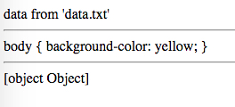

JavaScript Webpack "raw-loader" Demo
====================================

在JavaScript中，把指定的文件以字符串的形式import进来。

需要注意的是，webpack对`.json`文件有特殊的处理，无法使用外部loader，只能以object的形式自动加载。

```
npm install
npm run demo
```

Then open `index.html` in your browser.


